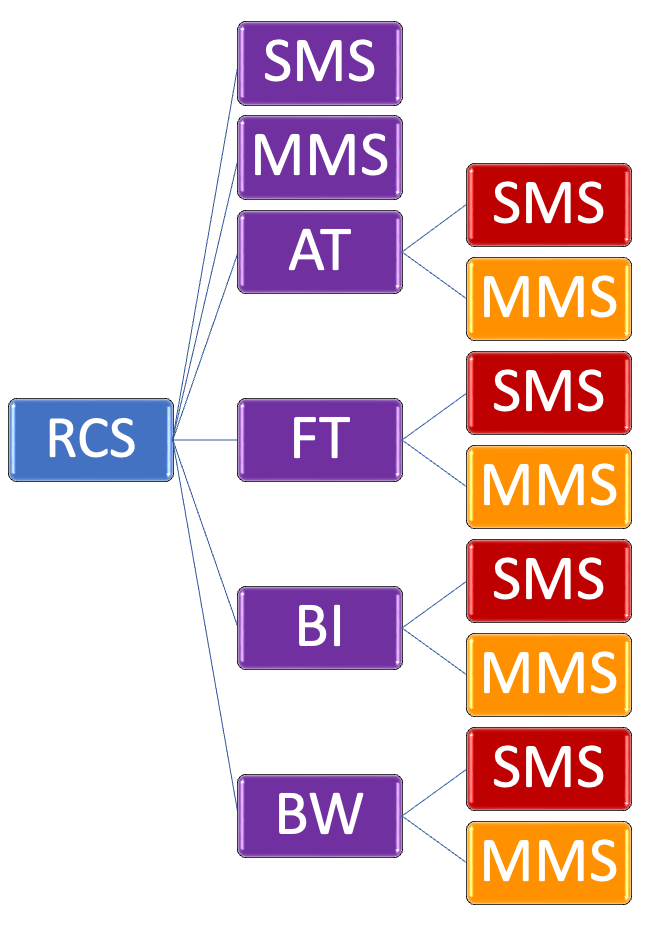

# 대체 발송 시나리오

&#x20;                [**Original 메시지**](undefined.md)                                      ****                                      [**1차 대체 발송**](undefined.md#at-ft-+-1)                                       ****                                       [**2차 대체 발송**](undefined.md#at-ft-+-2)****

.png>)

&#x20;                [**Original 메시지**](rcs.md#rcs)                                      ****                                      [**1차 대체 발송**](rcs.md#rcs-+-1)                                      ****                                      [ **2차 대체 발송**](rcs.md#rcs-+-2)****

